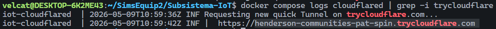

# Subsistema-IoT

## Execució del subsistema

Executar al directori del Microservei
- docker compose down -v && docker compose up -d --build

veure el fast tunnel
- docker compose logs cloudflared | grep -i trycloudflare


### Raspberry

Accedir als arxius del repositori clonat.
- Subsistema-IoT/raspberry

Crear entorn virtual.
- python3 -m venv venv
- source /venc/bin/activate

Instal·lar dependències.
- pip install -r requirements.txt

Introdüir el nou tunnel a la variable del .env

Executar deploy.sh, que executa l'script que envia les dades del thermistor i crea el webhook.
- ./deploy.sh


Afegir aquest tunel al .env del subsistema.


## Diagrama subsistema


## Actuador On / OFF

En aquesta part del projecte tindrem un mòdul d'alimentació 

En aquesta part del projecte tindrem una petita controladora conectada a la protoboard, utilitzarem una pila per donar energia a questa. La raspberry controlarà si la controladora està ON/OFF. Aquesta controladora haurà d'engegar un led per simular l'encesa del vehicle.
 Un cop tinguem aquesta part funcionant pasarem a utilitzar la controladora que es connectará amb el vehicle.

### Control per GPIO (implementación)

La API FastAPI incluye control ON/OFF por GPIO (BCM) en estos endpoints (protegidos con `X-API-Key`):

- `GET  /api/actuator/` → estado
- `POST /api/actuator/on` → ON
- `POST /api/actuator/off` → OFF

Por seguridad, el actuador está **deshabilitado por defecto**. Habilítalo con variables de entorno:

```env
ACTUATOR_ENABLED=1
ACTUATOR_GPIO_PIN=24
ACTUATOR_ACTIVE_HIGH=1
```

Importante:

- Si ejecutas la API en un PC/WSL o en Docker sin acceso a hardware, verás `available=false` y los comandos ON/OFF devolverán 503.
- Para control real de GPIO, ejecuta la API en la Raspberry Pi.

Modo desarrollo (PC/WSL):

```env
ACTUATOR_ENABLED=1
ACTUATOR_SIMULATE=1
```

Con `ACTUATOR_SIMULATE=1`, la API simula el ON/OFF (sin tocar GPIO) y deja de responder 503.

Docker en Raspberry Pi (con acceso a GPIO):

```bash
docker compose -f docker-compose.yml -f docker-compose.pi.yml up -d --build
```

Notas de conexión (seguridad):

- **LED (demo):** GPIO → resistencia (220–1kΩ) → ánodo LED; cátodo LED → GND.
- **Relé:** usa un módulo con transistor/optocoplador. Muchos son *active-low* → pon `ACTUATOR_ACTIVE_HIGH=0`.
- **Motor/solenoide:** nunca directo al GPIO; usa MOSFET/transistor + diodo flyback.

Opcional (en la Raspberry): API Flask mínima para controlar el GPIO localmente.

- Script: `raspberry/actuator_flask.py`
- Endpoints: `GET /status`, `POST /on`, `POST /off`

## Evolució

Aquests son els components que utilitzarem per crear l'actuador:

### MÒDUL ALIMENTACIÓ MB102


### CABLE PILA -> MÒDUL ALIMENTACIÓ


### RELÉ


---

 ## Sensor GPS
 Necesitem demanar el sensor GPS.
 Per enviar les dades del GPS utilitzarem cloudfare tunnel.

  ## Evolució

 Fins ara hem utilitzar un sensor de temperatura per simular l'enviament de dades del GPS.
 
 
 


(+ Afegir imatge amb recepció de dades desde postman / mongoDB Atlas)

---
